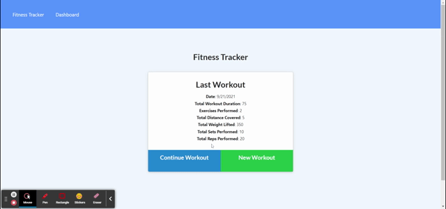

# Fitness Tracker

## Assignment Task

For this assignment, I created a workout tracker utilizing the provided front end code. This app uses a Mongo database with a Mongoose schema and handle routes with Express.

## User Story

- As a user, I want to be able to view create and track daily workouts. I want to be able to log multiple exercises in a workout on a given day. I should also be able to track the name, type, weight, sets, reps, and duration of exercise. If the exercise is a cardio exercise, I should be able to track my distance traveled.

## Acceptance Criteria

When the user loads the page, they should be given the option to create a new workout or continue with their last workout.

The user should be able to:

- Add exercises to the most recent workout plan.

- Add new exercises to a new workout plan.

- View the combined weight of multiple exercises from the past seven workouts on the `stats` page.

- View the total duration of each workout from the past seven workouts on the `stats` page.

## GIF Demo of App

-

## Links

- https://dashboard.heroku.com/apps/fitness-tracker-jkla/deploy/github
- https://github.com/JKLA13/fitness-tracker

## Tech Used

*Javascript
*MongoDB
*Mongoose
*Node.js
*VS Code
*Git

## Contributors

Jacob Adamson

## Questions

Email me:
 
My Github: [JKLA13](https://github.com/JKLA13) 
Questions? Email me: jakeladamson0@gmail.com 
